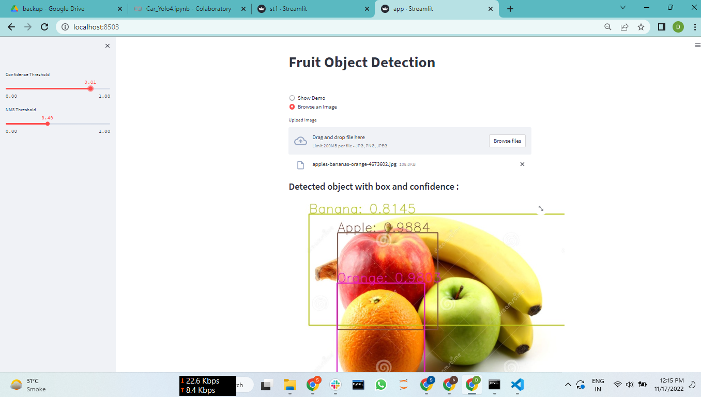

# Oject_Detection_YoloV4-
## Data Overview

It's Fruits Images dataset which has Three class like-Apple,Banana,Orange and Each class has around 300 Images.I have done this project using YoloV4 model It's giving me very accurate prediction. Data Source:-[Click Here to Download the dataset](https://www.kaggle.com/datasets/mbkinaci/fruit-images-for-object-detection).

## Library and Tools

* Python
* Numpy
* Matplotlib
* Open-Cv
* Pre-trained Models
* Streamlit
* Google Colab
* Visual Studio
* YOLOV4

## YOLOv4 Setup

### Dataset setup-

* First We'll have one main folder and inside that folder we have two folder Train and Test(Ratio 80:20 or 75:25).
* In Train dataset we'll have all image and their corresponding txt files and same in Test folder

* If We have images and XML files so yolo doesn't support it, we need to convert it into txt format [Click Here to Convert XML format to TXT](https://github.com/Sunil7987/Oject_Detection_YoloV4-/blob/main/convert_pascal_voc_XML_to_YOLO_txt_on_Fruits_object_detection.ipynb)
* Our dataset is ready.

### YOLOv4 Configuration-

* First We have to clone the github repository of darknet.[Follow this Notebook](https://github.com/Sunil7987/Oject_Detection_YoloV4-/blob/main/YOLOv4_Train__Setupipynb.ipynb)

* Then go into the darknet folder.

* Now we need to make some changes in make file

* Download the the pretrained darknet weights

* Now we have to generate train.txt and test.txt file for that we have to follow this Notebook [Click Here](https://github.com/Sunil7987/Oject_Detection_YoloV4-/blob/main/Generate_train_txt_and_test_txt_file_for_yoloV4.ipynb)

* And give the path of all the train and test images folder
* Now we have to run the script to generate the train.txt and test.txt file.
   then we will get in our dataset folder train.txt and test.txt files
   then move these file from here to darknet data folder 

* Now go into the data folder

here we have to make some changes in this folder files-

first we need to change .data extension file if you don't get this extension file just create it 
and in this file first we have to put classes name according to your dataset.

* then give the path of train.txt and test.txt in data.data folder

* put the path of data.names file which would be in your data folder in darknet

* finally we have to put the path of our backup folder which would be in our darknet folder
   Now Our data.data file setup and it should be look like this-
   
   
   

* Now we need make some change in data.names file write all the labels name which is in your dataset
 and should be look like this:-

* come to the cfg folder you will get one file named(yolov4-custom.cfg)
  
* *Open this file line number six , batch should be 16 or 32 or 64 
*   line number 7, subdivisions = 16
*   line number 8,  width = 416
*  line number 8, height = 416
*  line number 20,
*  max_batch = (Classes*2000)
*  in my case I have 3 classes so max_batches will be 6000  and (for 1,2,3 classes minimum max_batches = 6000)
     
*  line number 22, steps= 5400,4800 (means first 90% of max_batches and second 80% of max_batches 

*    now press control F and search yolo You'll get three yolo name(line number- 967,1055,1143)
*    all three yolo word below you will see classes(line number- 970,1058,1146) change the classes accoding to your dataset classes i have three classes)
*    and above the yolo you'll see filters(line number- 963,1051,1139)
*    put filters = 24
*    how to find filter for your dataset((classes+5)*3) use this I have three classes i got 24
*    now our cfg file is ready , instead of this file we can delete all files from cfg folder.

## Model Deployment

* For Deployement I used streamlit and I've followed such steps:-
* Create a Folder
* make a file named requirements.txt and put all the required library inside it.
* Create a Virtual Environment inside this folder Follow these Steps -
* Open your command prompt in VS Code and write this command (python -m venv VE_name) and hit enter.
* After that you need to activate this virtual environment for that write this command (VE_name\Scripts\activate) and hit enter.
* You've Activated your virtual environment and you need to install all your required library for creating this app.
* Then Create a python file and write code for streamlit app
* Fro executing this code run this command in command prompt (streamlit run python_file_name.py)

## Final Output 

